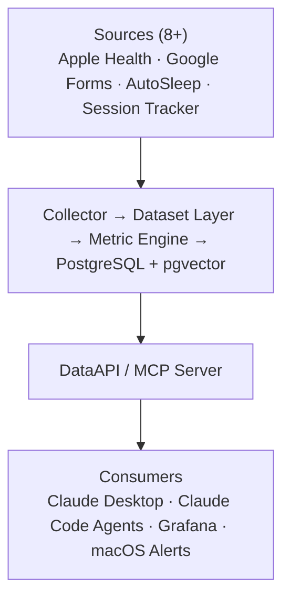

# Autodiary — Personal Analytics Platform

> Превращает разрозненные жизненные данные в понятные выводы и действия.
> Evidence-first: каждый вывод опирается на данные, а не на ощущения.

> **Built with:** [Claude Code](https://docs.anthropic.com/en/docs/claude-code) как AI-harness — от кода, тестов и миграций до аналитических агентов, консультанта по здоровью и доставки контента в Telegram.

---

## Проблема

Трекеры генерируют море данных — пульс, сон, тренировки, дневник, рабочие сессии — но каждый живёт в своём силосе. Кросс-доменные связи (сон ↔ продуктивность ↔ здоровье) невидимы. 160+ метрик, ни одного вывода.

## Решение

```
Signals → Aggregates → Evidence → Insights → Actions
                    ↻ Continual Improvement (ITIL SVS)
```

Единая аналитическая платформа: собирает сигналы из 8+ источников, агрегирует в метрики, находит паттерны, формулирует инсайты с доказательной базой и предлагает конкретные действия. Замкнутый цикл — система учится на обратной связи.

---

## Архитектура



**Config-driven:** добавление метрики = одна запись в YAML + один калькулятор.

---

## Ключевые возможности

🔬 **Evidence-first AI** — вывод без доказательной базы блокируется или маркируется как гипотеза

🔗 **Кросс-доменный анализ** — сон ↔ продуктивность ↔ здоровье ↔ тренировки в одной системе

🩺 **Слой здоровья** — личный медархив → LLM-ready карточки, хронические нити и тренды анализов; консультант `/health-consult` отвечает по истории болезни (claimed/observed/patient, честно хеджит)

🧠 **Живая память** — 53 инсайта, pgvector дедупликация, Merge & Enrich

📚 **Грунтовка знанием** — анализаторы подтверждают паттерны идеями из прочитанных книг: личная библиотека как внешнее доказательство в панели «Обоснование уверенности»

🔄 **Feedback loop** — оценки инсайтов адаптируют критерии извлечения

🔒 **Privacy by design** — 3 профиля видимости, masked values, демо на реальных данных

🔌 **LLM-agnostic** — MCP контракт не зависит от модели

---

## Демо

<!-- Скриншоты в privacy mode -->

| Grafana: дашборд активности | Grafana: дашборд инсайтов |
|:--:|:--:|
|  |  |

| Claude Desktop: ad-hoc вопрос через MCP | MCP Server config |
|:--:|:--:|
|  |  |

---

## Технологии

`Python 3.11` · `FastAPI` · `PostgreSQL + pgvector` · `Pydantic` · `Alembic` · `Docker Compose` · `Grafana` · `FastMCP` · `Claude Code` · `Google Drive API` · `pymorphy3`

## Система в числах

| Метрики | Домены | Источники | Данные | Инсайты | Дашборды |
|:-------:|:------:|:---------:|:------:|:-------:|:--------:|
| 160+ | 9 | 8+ | 800+ дней | 53 | 10+ |

---

## Слой здоровья и `/health-consult`

Личный медицинский архив (печатные документы, исследования, анализы за 16 лет) превращается в LLM-ready слой здоровья:

- **vision-OCR** печатных сканов и PDF → структурированные карточки кейсов (жалоба, наблюдения, диагнозы, назначения, анализы)
- **хронические нити** — связанные эпизоды одной проблемы сшиваются в единый нарратив через годы
- **тренды анализов** — числовые результаты сводятся в единый канон + экспорт
- **три слоя достоверности** — со слов врача (`claimed`) / приборное наблюдение (`observed`) / подтверждённое пациентом (`patient`); provenance обязателен, диагнозы не до-придумываются из симптомов

Поверх слоя — команда **`/health-consult`**: персональный консультант, который отвечает на вопросы по личной истории болезни, ведёт хронические нити, связывает текущий симптом с прошлым эпизодом и подтягивает сигналы autodiary (сон/активность/тело). Честно хеджит — **не заменяет врача**.

> 🔒 **Privacy by design.** В публичном репозитории слой здоровья показан только на обезличенных/демо-данных. Реальная медицинская история не коммитится и наружу через MCP не выставляется — полные нарративы читаются агентами локально из файлов.

---

## Команды и ритуалы

Claude Code-команды поверх MCP-контракта — повторяющаяся аналитика со структурированным выводом:

- **`/weekly-coach`**, **`/monthly-analyst`** — еженедельные и ежемесячные отчёты с инсайтами (ежемесячный грунтует выводы идеями из прочитанных книг)
- **`/phrases`** — утренний ритуал «7 фраз»: только цитаты (авторы засеяны из любимых книг личной библиотеки, сами цитаты генерит LLM), сбор обратной связи сведён к одному вопросу. Evidence-first и петля обратной связи на маленьком инструменте
- **`/health-consult`** — персональный медицинский консультант по личной истории болезни (см. выше)
- **`/research-studio`** — лёгкий single-pass конвейер: инсайт autodiary → исследование → текст → QA → публикация в Telegram → сбор обратной связи → короткая CEO-рефлексия. Одна тема за сессию; посты двух типов — **Actions** (что делать) и **Context** (что знать); QA допускает до 3 ревизий и затем публикует с пометкой (никогда не блокирует)

*Research studio вырос из multi-agent-прототипа в лёгкую single-pass-версию.*

---

## Документация

- [Видение и цели](docs/vision.md)
- [Методология](docs/methodology.md)
- [Продуктовая презентация (PDF)](presentation/autodiary_product.pdf)
- Техническая презентация — по запросу

---

## Контакт

Dmitrii Naumenko — [dmitrii@dsnaumenko.ru](mailto:dmitrii@dsnaumenko.ru) · [@naumenko_ds](https://t.me/naumenko_ds)

---

*Showcase-репозиторий. Исходный код — в приватном репо.*
