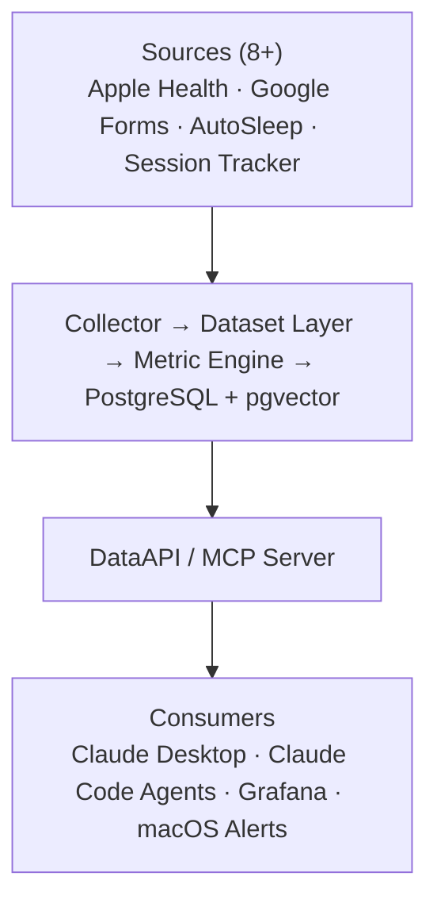
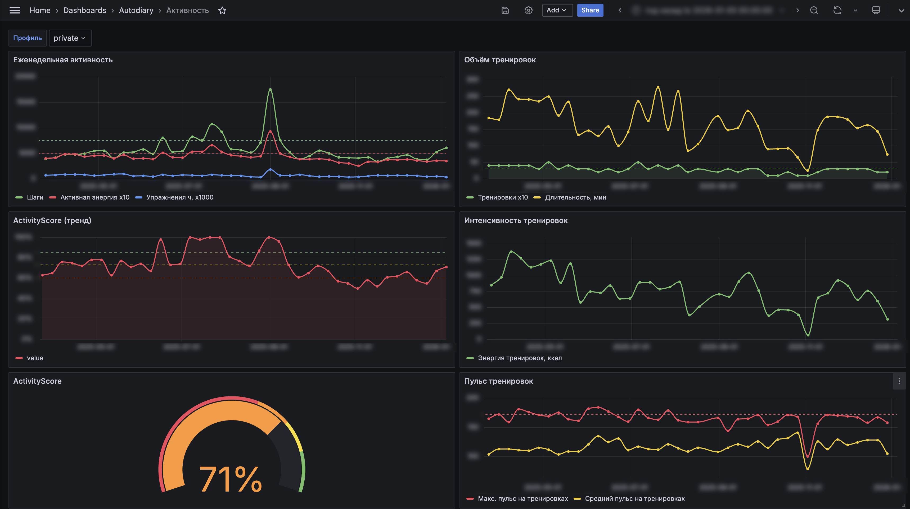
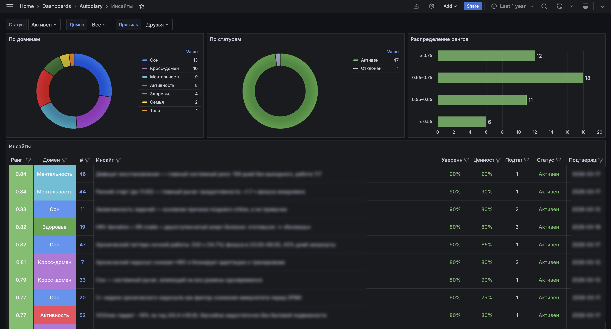
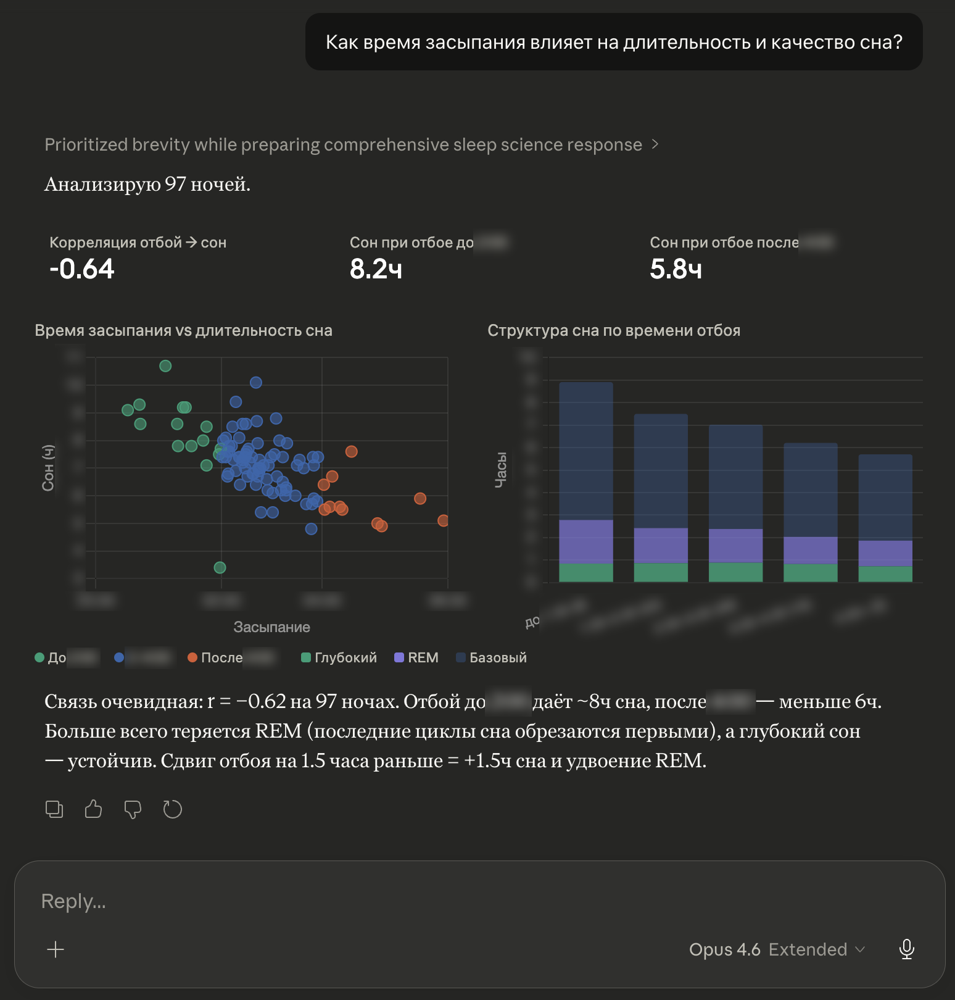
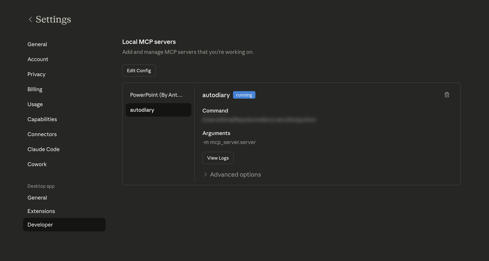

# Autodiary — Personal Analytics Platform

> Превращает разрозненные жизненные данные в понятные выводы и действия.
> Evidence-first: каждый вывод опирается на данные, а не на ощущения.

> **Built with:** [Claude Code](https://docs.anthropic.com/en/docs/claude-code) как AI harness для разработки и аналитики, [Paperclip](https://github.com/paperclipai/paperclip) + [Codex](https://github.com/openai/codex) как AI Factory — multi-agent конвейер от данных до готового контента в Telegram.

---

## Проблема

Трекеры генерируют море данных — пульс, сон, тренировки, дневник, рабочие сессии — но каждый живёт в своём силосе. Кросс-доменные связи (сон ↔ продуктивность ↔ здоровье) невидимы. 160+ метрик, ни одного вывода.

## Решение

```
Signals → Aggregates → Evidence → Insights → Actions
                    ↻ Continual Improvement (ITIL SVS)
```

Единая аналитическая платформа: собирает сигналы из 8+ источников, агрегирует в метрики, находит паттерны, формулирует инсайты с доказательной базой и предлагает конкретные действия. Замкнутый цикл — система учится на обратной связи.

---

## Архитектура



**Config-driven:** добавление метрики = одна запись в YAML + один калькулятор.

---

## Ключевые возможности

🔬 **Evidence-first AI** — вывод без доказательной базы блокируется или маркируется как гипотеза

🔗 **Кросс-доменный анализ** — сон ↔ продуктивность ↔ здоровье ↔ тренировки в одной системе

🧠 **Живая память** — 53 инсайта, pgvector дедупликация, Merge & Enrich

🔄 **Feedback loop** — оценки инсайтов адаптируют критерии извлечения

🔒 **Privacy by design** — 3 профиля видимости, masked values, демо на реальных данных

🔌 **LLM-agnostic** — MCP контракт не зависит от модели

---

## Демо

<!-- Скриншоты в privacy mode -->

| Grafana: дашборд активности | Grafana: дашборд инсайтов |
|:--:|:--:|
|  |  |

| Claude Desktop: ad-hoc вопрос через MCP | MCP Server config |
|:--:|:--:|
|  |  |

---

## Технологии

`Python 3.11` · `FastAPI` · `PostgreSQL + pgvector` · `Pydantic` · `Alembic` · `Docker Compose` · `Grafana` · `FastMCP` · `Claude Code` · `Google Drive API` · `pymorphy3`

## Система в числах

| Метрики | Домены | Источники | Данные | Инсайты | Дашборды |
|:-------:|:------:|:---------:|:------:|:-------:|:--------:|
| 160+ | 9 | 8+ | 800+ дней | 53 | 10+ |

---

## Personal Research Studio

Multi-agent компания на базе [Paperclip](https://github.com/paperclipai/paperclip), которая превращает инсайты autodiary в исследованные рекомендации и доставляет их в Telegram-канал.

**Вход:** инсайты из autodiary (160+ метрик, 9 доменов) через MCP.

**Выход:** посты двух типов:
- **Actions** — что делать: evidence-based рекомендации, протоколы, follow-up'ы
- **Context** — что знать: обзоры исследований, объяснения механизмов

**8 агентов, 2 департамента:**

```
Research: Head of Research → Literature Researcher → Research Critic → Head of Research
Content:  Head of Content → Writer → QA Reviewer → Head of Content → Telegram Agent
```

Координация через **topic folders** — каждый topic получает папку с артефактами, агенты продвигают pipeline через CLI-утилиту. Нет race conditions, полный аудит, версионирование.

**Feedback loop:** реакции и комментарии в Telegram корректируют стратегию и качество контента.

---

## Документация

- [Видение и цели](docs/vision.md)
- [Методология](docs/methodology.md)
- [Продуктовая презентация (PDF)](presentation/autodiary_product.pdf)
- Техническая презентация — по запросу

---

## Контакт

Dmitrii Naumenko — [dmitrii@dsnaumenko.ru](mailto:dmitrii@dsnaumenko.ru) · [@naumenko_ds](https://t.me/naumenko_ds)

---

*Showcase-репозиторий. Исходный код — в приватном репо.*
